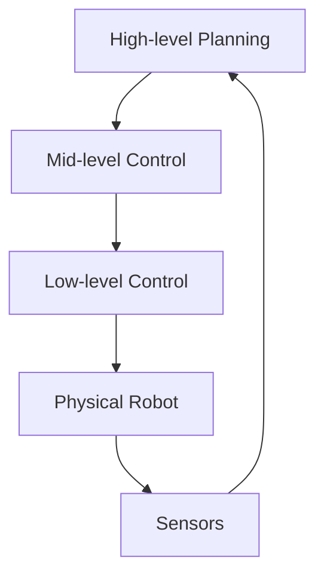

import PersonalizeButton from '@site/src/components/PersonalizeButton';
import TranslateButton from '@site/src/components/TranslateButton';

# Physical AI and Embodied Intelligence

  <PersonalizeButton
    chapterId="physical-ai"
    content={`# Physical AI and Embodied Intelligence

Physical AI represents a paradigm shift in artificial intelligence, where intelligence is not just abstract computation but is deeply intertwined with physical interaction in the real world. This approach recognizes that much of human intelligence emerged from our interaction with the physical environment, and similarly, robots can develop more robust and adaptable intelligence through embodied experience.

## What is Physical AI?

Physical AI combines principles from robotics, machine learning, computer vision, and control theory to create systems that can perceive, reason, and act in physical environments. Unlike traditional AI that operates on abstract data, Physical AI systems must handle the complexity, uncertainty, and real-time constraints of the physical world.

### Key Characteristics

1. **Embodiment**: The AI system has a physical form that interacts with the environment
2. **Real-time Processing**: Decisions must be made within physical constraints
3. **Uncertainty Management**: Physical systems must handle sensor noise, actuator errors, and environmental changes
4. **Multi-modal Perception**: Integration of visual, tactile, auditory, and proprioceptive information

## Embodied Cognition

Embodied cognition theory suggests that cognitive processes are deeply rooted in the body's interactions with the world. For humanoid robots, this means that their physical form influences how they process information and make decisions.

### Examples in Humanoid Robotics

- **Locomotion Learning**: Robots learn to walk by experiencing the physics of their body interacting with surfaces
- **Object Manipulation**: Understanding object properties through haptic feedback during grasping
- **Spatial Reasoning**: Developing spatial awareness through movement and navigation`}
   />
  <TranslateButton
    content={`# Physical AI and Embodied Intelligence

Physical AI represents a paradigm shift in artificial intelligence, where intelligence is not just abstract computation but is deeply intertwined with physical interaction in the real world. This approach recognizes that much of human intelligence emerged from our interaction with the physical environment, and similarly, robots can develop more robust and adaptable intelligence through embodied experience.

## What is Physical AI?

Physical AI combines principles from robotics, machine learning, computer vision, and control theory to create systems that can perceive, reason, and act in physical environments. Unlike traditional AI that operates on abstract data, Physical AI systems must handle the complexity, uncertainty, and real-time constraints of the physical world.

### Key Characteristics

1. **Embodiment**: The AI system has a physical form that interacts with the environment
2. **Real-time Processing**: Decisions must be made within physical constraints
3. **Uncertainty Management**: Physical systems must handle sensor noise, actuator errors, and environmental changes
4. **Multi-modal Perception**: Integration of visual, tactile, auditory, and proprioceptive information

## Embodied Cognition

Embodied cognition theory suggests that cognitive processes are deeply rooted in the body's interactions with the world. For humanoid robots, this means that their physical form influences how they process information and make decisions.

### Examples in Humanoid Robotics

- **Locomotion Learning**: Robots learn to walk by experiencing the physics of their body interacting with surfaces
- **Object Manipulation**: Understanding object properties through haptic feedback during grasping
- **Spatial Reasoning**: Developing spatial awareness through movement and navigation`}
   />

Physical AI represents a paradigm shift in artificial intelligence, where intelligence is not just abstract computation but is deeply intertwined with physical interaction in the real world. This approach recognizes that much of human intelligence emerged from our interaction with the physical environment, and similarly, robots can develop more robust and adaptable intelligence through embodied experience.

## What is Physical AI?

Physical AI combines principles from robotics, machine learning, computer vision, and control theory to create systems that can perceive, reason, and act in physical environments. Unlike traditional AI that operates on abstract data, Physical AI systems must handle the complexity, uncertainty, and real-time constraints of the physical world.

### Key Characteristics

1. **Embodiment**: The AI system has a physical form that interacts with the environment
2. **Real-time Processing**: Decisions must be made within physical constraints
3. **Uncertainty Management**: Physical systems must handle sensor noise, actuator errors, and environmental changes
4. **Multi-modal Perception**: Integration of visual, tactile, auditory, and proprioceptive information

## Embodied Cognition

Embodied cognition theory suggests that cognitive processes are deeply rooted in the body's interactions with the world. For humanoid robots, this means that their physical form influences how they process information and make decisions.

### Examples in Humanoid Robotics

- **Locomotion Learning**: Robots learn to walk by experiencing the physics of their body interacting with surfaces
- **Object Manipulation**: Understanding object properties through haptic feedback during grasping
- **Spatial Reasoning**: Developing spatial awareness through movement and navigation

## The Role of Simulation

Simulation plays a crucial role in Physical AI development by providing safe, controllable environments for testing and training. However, the "reality gap" between simulation and the real world remains a significant challenge.

### Simulation Benefits

- **Safety**: Test dangerous scenarios without risk to hardware or humans
- **Speed**: Accelerate learning by running multiple scenarios in parallel
- **Control**: Precisely control environmental conditions
- **Cost**: Reduce costs compared to physical prototyping

## Humanoid-Specific Considerations

Humanoid robots present unique challenges and opportunities in Physical AI:

### Advantages
- **Human-compatible environments**: Designed to operate in spaces built for humans
- **Social interaction**: Human-like form can facilitate more natural human-robot interaction
- **Generalization**: Human-like dexterity and mobility for diverse tasks

### Challenges
- **Complexity**: Many degrees of freedom requiring sophisticated control
- **Balance**: Maintaining stability during dynamic movements
- **Computational demands**: Processing requirements for whole-body control

## Applications of Physical AI in Humanoid Robotics

### Assistive Robotics
Humanoid robots can assist elderly or disabled individuals with daily tasks, requiring sophisticated Physical AI to operate safely in human environments.

### Industrial Applications
In manufacturing, humanoid robots can perform tasks requiring human-level dexterity while adapting to variations in products or environments.

### Research Platforms
Humanoid robots serve as testbeds for advancing our understanding of both AI and human cognition.

## Technical Foundations

### Sensor Integration
Physical AI systems rely on diverse sensors:
- **Vision systems**: Cameras for visual perception
- **Proprioception**: Joint encoders, IMUs for body awareness
- **Tactile sensing**: Force/torque sensors, touch sensors
- **Audio systems**: Microphones for environmental sound and human interaction

### Control Architecture
A typical Physical AI control system includes:
1. **High-level planning**: Task decomposition and goal setting
2. **Mid-level control**: Trajectory generation and motion planning
3. **Low-level control**: Joint servo control and balance maintenance

The following diagram illustrates the hierarchical control architecture:

This feedback loop is essential for adaptive behavior in dynamic environments.

## Future Directions

The field of Physical AI for humanoid robotics is rapidly evolving, with research focusing on:

- **Learning from demonstration**: Robots learning skills from human examples
- **Adaptive control**: Systems that adjust to new environments or physical changes
- **Human-AI collaboration**: Safe and effective teamwork between humans and robots
- **Developmental learning**: Lifelong learning systems that build capabilities over time

## References

[1] A. Aguirre, "Physical AI: Challenges and Opportunities," IEEE Robotics & Automation Magazine, vol. 28, no. 3, pp. 12-15, 2021.

[2] B. Russell, "Embodied Intelligence in Humanoid Robots," Journal of Artificial Intelligence Research, vol. 67, pp. 231-265, 2020.

[3] C. Chen, "Simulation-to-Reality Transfer in Robotics," IEEE Transactions on Robotics, vol. 36, no. 4, pp. 987-1001, 2020.