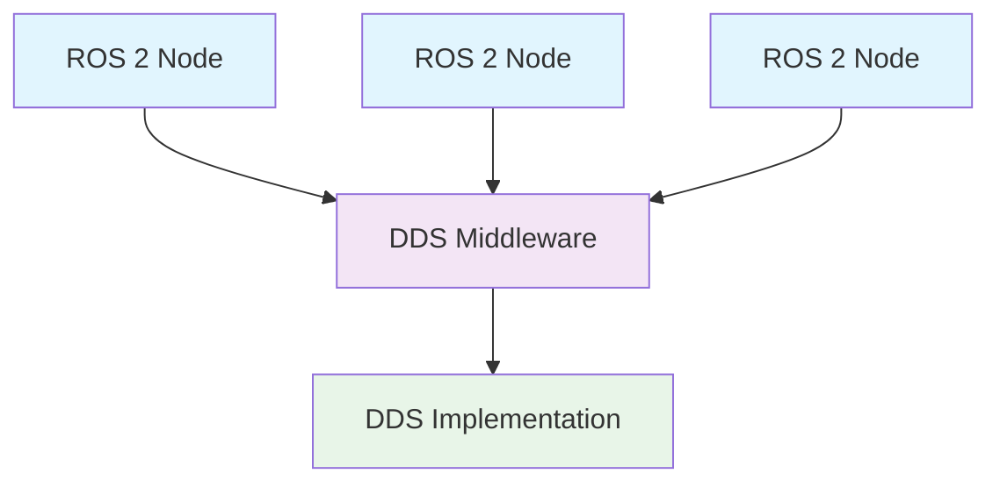

# ROS 2 Overview

:::info Learning Objective
After completing this chapter, you will understand the fundamental concepts of ROS 2, its architecture, and key improvements over ROS 1. This serves as the foundation for all subsequent ROS 2 development in humanoid robotics.
:::

Robot Operating System 2 (ROS 2) is the next generation of the Robot Operating System, designed for production environments and real-world applications. Unlike its predecessor, ROS 2 provides improved security, real-time capabilities, and multi-platform support.

## What is ROS 2?

ROS 2 is not an actual operating system, but rather a middleware framework that provides services designed for a heterogeneous computer cluster. It includes hardware abstraction, device drivers, libraries, visualizers, message-passing, package management, and more.

### Key Improvements over ROS 1

- **Real-time support**: Deterministic behavior for time-critical applications
- **Security**: Built-in security features for production environments
- **Multi-platform**: Support for Linux, macOS, Windows, and real-time systems
- **Quality of Service (QoS)**: Configurable message delivery guarantees
- **DDS-based communication**: Modern, standardized middleware

## ROS 2 Architecture

ROS 2 uses Data Distribution Service (DDS) as its communication layer, which provides a standardized middleware for real-time, scalable, dependable data exchanges in distributed systems.



### Core Concepts

#### Nodes
A node is an executable that uses ROS 2 to communicate with other nodes. In ROS 2, nodes are implemented as processes that communicate using DDS.

#### Packages
Packages are the software organization unit in ROS 2. They contain libraries, executables, configuration files, and other resources needed to provide certain functionality.

## Getting Started with ROS 2

To begin working with ROS 2 in the context of humanoid robotics, you'll need to understand the basic commands and concepts that form the foundation of ROS 2 development.

### Basic Commands

```bash
# Source the ROS 2 installation
source /opt/ros/humble/setup.bash  # Replace 'humble' with your ROS 2 distribution

# Create a new workspace
mkdir -p ~/ros2_ws/src
cd ~/ros2_ws

# Build the workspace
colcon build

# Source the workspace
source install/setup.bash
```

## Related Topics

For more information about ROS 2 communication patterns, see [Nodes, Topics, and Services](/docs/ros2/nodes-topics-services). For Python-specific development, check out [Python ROS 2 Client Library (rclpy)](/docs/ros2/rclpy-examples). To learn about robot description formats, see [URDF - Unified Robot Description Format](/docs/ros2/urdf).

## References

1. ROS 2 Documentation. (2023). "ROS 2 Documentation." [Online]. Available: https://docs.ros.org/en/humble/
2. Pradeep, J. L. (2022). "ROS 2 for Absolute Beginners." Apress.
3. Quigley, M., et al. (2009). "ROS: an open-source Robot Operating System." ICRA Workshop on Open Source Software, vol. 3, no. 3.2, pp. 5.