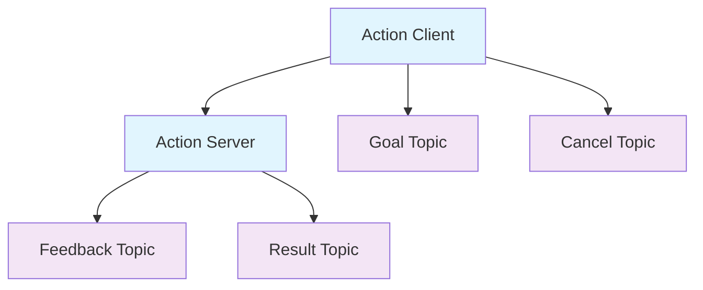

# Nodes, Topics, and Services

:::info Learning Objective
After completing this chapter, you will understand the core communication patterns in ROS 2: nodes, topics, services, and actions. You will be able to implement publishers, subscribers, servers, and clients for effective robot communication.
:::

ROS 2 provides several communication patterns that allow nodes to exchange information. Understanding these patterns is crucial for developing effective robotic applications.

## Nodes

A node is an executable that uses ROS 2 to communicate with other nodes. Nodes are the fundamental building blocks of a ROS 2 system. Each node can perform specific functions and communicate with other nodes through topics, services, or actions.

### Creating a Node

```python
import rclpy
from rclpy.node import Node

class MinimalNode(Node):
    def __init__(self):
        super().__init__('minimal_publisher')
        # Node initialization code here
```

## Topics

Topics provide a publish-subscribe communication model. Publishers send messages to topics, and subscribers receive messages from topics. This is an asynchronous, decoupled communication pattern.

### Publisher Example

```python
import rclpy
from rclpy.node import Node
from std_msgs.msg import String

class MinimalPublisher(Node):
    def __init__(self):
        super().__init__('minimal_publisher')
        self.publisher_ = self.create_publisher(String, 'topic', 10)
        timer_period = 0.5  # seconds
        self.timer = self.create_timer(timer_period, self.timer_callback)
        self.i = 0

    def timer_callback(self):
        msg = String()
        msg.data = 'Hello World: %d' % self.i
        self.publisher_.publish(msg)
        self.get_logger().info('Publishing: "%s"' % msg.data)
        self.i += 1
```

### Subscriber Example

```python
import rclpy
from rclpy.node import Node
from std_msgs.msg import String

class MinimalSubscriber(Node):
    def __init__(self):
        super().__init__('minimal_subscriber')
        self.subscription = self.create_subscription(
            String,
            'topic',
            self.listener_callback,
            10)
        self.subscription  # prevent unused variable warning

    def listener_callback(self, msg):
        self.get_logger().info('I heard: "%s"' % msg.data)
```

## Services

Services provide a request-response communication model. A client sends a request to a service, and the service sends back a response. This is a synchronous communication pattern.

### Service Server Example

```python
from example_interfaces.srv import AddTwoInts
import rclpy
from rclpy.node import Node

class MinimalService(Node):
    def __init__(self):
        super().__init__('minimal_service')
        self.srv = self.create_service(AddTwoInts, 'add_two_ints', self.add_two_ints_callback)

    def add_two_ints_callback(self, request, response):
        response.sum = request.a + request.b
        self.get_logger().info('Incoming request\na: %d b: %d' % (request.a, request.b))
        return response
```

### Service Client Example

```python
from example_interfaces.srv import AddTwoInts
import rclpy
from rclpy.node import Node

class MinimalClientAsync(Node):
    def __init__(self):
        super().__init__('minimal_client_async')
        self.cli = self.create_client(AddTwoInts, 'add_two_ints')
        while not self.cli.wait_for_service(timeout_sec=1.0):
            self.get_logger().info('service not available, waiting again...')
        self.req = AddTwoInts.Request()

    def send_request(self, a, b):
        self.req.a = a
        self.req.b = b
        self.future = self.cli.call_async(self.req)
        rclpy.spin_until_future_complete(self, self.future)
        return self.future.result()
```

## Actions

Actions are used for long-running tasks that require feedback and the ability to cancel. They combine the features of topics and services.

### Action Architecture



## Quality of Service (QoS)

ROS 2 provides Quality of Service profiles that allow you to configure message delivery guarantees based on your application's needs.

### Common QoS Profiles

- **Reliable**: All messages are delivered, but may be slower
- **Best Effort**: Messages may be dropped, but delivery is faster
- **Keep Last**: Only the most recent messages are kept
- **Keep All**: All messages are kept in the queue

## Related Topics

For practical Python examples of these concepts, see [Python ROS 2 Client Library (rclpy)](/docs/ros2/rclpy-examples). To understand how to describe robots in ROS 2, check out [URDF - Unified Robot Description Format](/docs/ros2/urdf). For an overview of ROS 2, see [ROS 2 Overview](/docs/ros2).

## References

1. ROS 2 Documentation. (2023). "ROS 2 Concepts." [Online]. Available: https://docs.ros.org/en/humble/Concepts/About-Topics.html
2. Quigley, M., et al. (2009). "ROS: an open-source Robot Operating System." ICRA Workshop on Open Source Software, vol. 3, no. 3.2, pp. 5.
3. Macenski, S. (2022). "Professional ROS 2 Development." ROS Press.