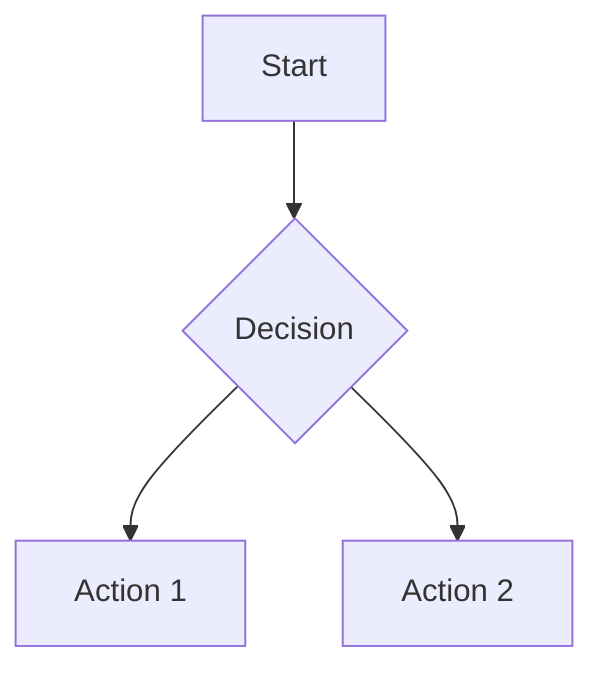
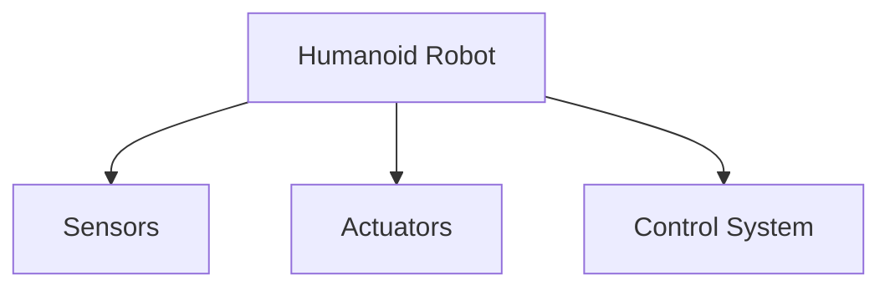

# Quickstart: Docusaurus-based Humanoid Robotics Book

## Prerequisites

- Node.js 18+ installed
- npm or yarn package manager
- Git for version control
- Basic knowledge of Markdown and MDX

## Setup Instructions

### 1. Clone and Initialize the Repository

```bash
git clone [repository-url]
cd [repository-name]
npm install
```

### 2. Install Docusaurus

```bash
npm init docusaurus@latest website classic
# Or if starting fresh:
npm install @docusaurus/core @docusaurus/preset-classic
```

### 3. Start Development Server

```bash
cd website
npm start
```

This will start a local development server at `http://localhost:3000` with live reloading.

## Adding a New Chapter

### 1. Create Chapter Files

Create a new directory in the `docs/` folder:

```bash
mkdir docs/new-chapter
```

Add your MDX content:

```bash
touch docs/new-chapter/index.mdx
```

### 2. Chapter Structure Template

```mdx
---
title: Chapter Title
sidebar_position: 1
description: Brief description of the chapter content
---

# Chapter Title

## Introduction

Brief introduction to the topic...

## Main Content

### Subsection

Content with code examples:

```python
# ROS 2 example
import rclpy
from rclpy.node import Node

class MinimalPublisher(Node):
    def __init__(self):
        super().__init__('minimal_publisher')
```

## Diagrams



## Conclusion

Summary of the chapter...
```

### 3. Update Sidebar Navigation

Add the new chapter to `sidebars.js`:

```javascript
module.exports = {
  docs: [
    {
      type: 'category',
      label: 'Introduction',
      items: ['introduction/index', 'introduction/physical-ai'],
    },
    // Add your new chapter here
  ],
};
```

## Adding Code Examples

Use standard Markdown code blocks with appropriate language identifiers:

````mdx
```python
# ROS 2 Python example
import rclpy
from rclpy.node import Node
```

```yaml
# Gazebo configuration example
robot:
  name: "my_robot"
  position: [0, 0, 0]
```
````

## Adding Diagrams

### Mermaid Diagrams



### Custom Diagram Components

For robotics-specific diagrams, create React components in `src/components/`:

```jsx
// In your MDX file
import RobotDiagram from '@site/src/components/RobotDiagram';

<RobotDiagram />
```

## Adding Citations

Follow IEEE citation format:

```
According to recent research [1], humanoid robots require sophisticated control systems.

References:
[1] A. Author, "Paper title," Journal Name, vol. X, no. Y, pp. ZZ-ZZ, Year.
```

## Building and Deployment

### Local Build Test

```bash
npm run build
```

### Serve Build Locally

```bash
npm run serve
```

## Validation Steps

Before committing changes:

1. Verify the site builds without errors: `npm run build`
2. Check all links are valid
3. Validate code examples against documentation
4. Ensure diagrams render correctly
5. Confirm citations follow IEEE format
6. Verify chapter word count (1000-2000 words)