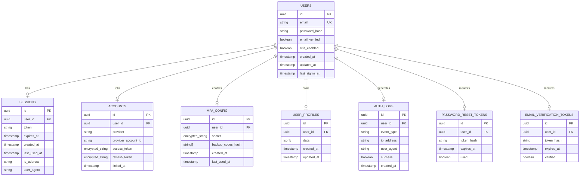

# Data Model: Better Auth Signup/Signin System

**Date**: 2025-12-28
**Feature**: Better Auth Signup/Signin with Onboarding Questionnaire

## Entity Relationship Diagram



## Database Tables (Drizzle Schema)

### users

```typescript
// src/db/schema.ts
import { pgTable, text, timestamp, uuid, boolean } from 'drizzle-orm/pg-core';

export const users = pgTable('users', {
  id: uuid('id').primaryKey().defaultRandom(),
  email: text('email').notNull().unique(),
  passwordHash: text('password_hash').notNull(),
  emailVerified: boolean('email_verified').notNull().default(false),
  mfaEnabled: boolean('mfa_enabled').notNull().default(false),
  createdAt: timestamp('created_at').notNull().defaultNow(),
  updatedAt: timestamp('updated_at').notNull().defaultNow(),
  lastSigninAt: timestamp('last_signin_at'),
});
```

### sessions

```typescript
export const sessions = pgTable('sessions', {
  id: uuid('id').primaryKey().defaultRandom(),
  userId: uuid('user_id').notNull().references(() => users.id, { onDelete: 'cascade' }),
  token: text('token').notNull().unique(),
  expiresAt: timestamp('expires_at').notNull(),
  createdAt: timestamp('created_at').notNull().defaultNow(),
  lastUsedAt: timestamp('last_used_at').notNull().defaultNow(),
  ipAddress: text('ip_address'),
  userAgent: text('user_agent'),
});
```

### accounts (OAuth linkages)

```typescript
export const accounts = pgTable('accounts', {
  id: uuid('id').primaryKey().defaultRandom(),
  userId: uuid('user_id').notNull().references(() => users.id, { onDelete: 'cascade' }),
  provider: text('provider').notNull(), // 'google' | 'github'
  providerAccountId: text('provider_account_id').notNull(),
  accessToken: text('access_token'), // encrypted
  refreshToken: text('refresh_token'), // encrypted
  linkedAt: timestamp('linked_at').notNull().defaultNow(),
});
```

### mfa_configurations

```typescript
export const mfaConfigurations = pgTable('mfa_configurations', {
  id: uuid('id').primaryKey().defaultRandom(),
  userId: uuid('user_id').notNull().references(() => users.id, { onDelete: 'cascade' }),
  secret: text('secret').notNull(), // encrypted TOTP secret
  backupCodesHash: text('backup_codes_hash').notNull(), // JSON array, hashed
  createdAt: timestamp('created_at').notNull().defaultNow(),
  lastUsedAt: timestamp('last_used_at'),
});
```

### user_profiles (JSONB flexible storage)

```typescript
export const userProfiles = pgTable('user_profiles', {
  id: uuid('id').primaryKey().defaultRandom(),
  userId: uuid('user_id').notNull().references(() => users.id, { onDelete: 'cascade' }),
  data: jsonb('data').notNull().default({}),
  createdAt: timestamp('created_at').notNull().defaultNow(),
  updatedAt: timestamp('updated_at').notNull().defaultNow(),
});
```

**JSONB Structure**:
```typescript
interface UserProfileData {
  softwareSkills: {
    python?: 'beginner' | 'intermediate' | 'advanced' | 'expert';
    javascript?: 'beginner' | 'intermediate' | 'advanced' | 'expert';
    cpp?: 'beginner' | 'intermediate' | 'advanced' | 'expert';
    [key: string]: string | undefined;
  };
  hardwareExperience: {
    hasRobotExperience: boolean;
    roboticsPlatforms: string[];
    rosExperience: 'none' | 'beginner' | 'intermediate' | 'advanced' | 'expert';
  };
  mlBackground: {
    mlLevel: 'none' | 'beginner' | 'intermediate' | 'advanced' | 'expert';
    hasLlmExperience: boolean;
    hasCvExperience: boolean;
  };
  interests: string[]; // 'healthtech' | 'cybersecurity' | 'ai' | etc.
  learningStyle: 'theory' | 'hands-on' | 'mixed';
  onboardingCompleted: boolean;
  lastCompletedStep: number;
}
```

### auth_logs (audit trail)

```typescript
export const authLogs = pgTable('auth_logs', {
  id: uuid('id').primaryKey().defaultRandom(),
  userId: uuid('user_id').references(() => users.id, { onDelete: 'set null' }),
  eventType: text('event_type').notNull(), // 'signin', 'signout', 'signup', 'password_reset', 'mfa_enabled', 'mfa_disabled'
  ipAddress: text('ip_address').notNull(),
  userAgent: text('user_agent'),
  success: boolean('success').notNull(),
  createdAt: timestamp('created_at').notNull().defaultNow(),
});
```

### verification_tokens

```typescript
export const passwordResetTokens = pgTable('password_reset_tokens', {
  id: uuid('id').primaryKey().defaultRandom(),
  userId: uuid('user_id').notNull().references(() => users.id, { onDelete: 'cascade' }),
  tokenHash: text('token_hash').notNull(),
  expiresAt: timestamp('expires_at').notNull(),
  used: boolean('used').notNull().default(false),
});

export const emailVerificationTokens = pgTable('email_verification_tokens', {
  id: uuid('id').primaryKey().defaultRandom(),
  userId: uuid('user_id').notNull().references(() => users.id, { onDelete: 'cascade' }),
  tokenHash: text('token_hash').notNull(),
  expiresAt: timestamp('expires_at').notNull(),
  verified: boolean('verified').notNull().default(false),
});
```

## Validation Rules (Zod Schemas)

### User Registration

```typescript
// src/auth/schemas/user.ts
import { z } from 'zod';

export const registerSchema = z.object({
  email: z.string().email('Invalid email address').toLowerCase(),
  password: z.string()
    .min(8, 'Password must be at least 8 characters')
    .regex(/[A-Z]/, 'Password must contain at least one uppercase letter')
    .regex(/[a-z]/, 'Password must contain at least one lowercase letter')
    .regex(/[0-9]/, 'Password must contain at least one number'),
  confirmPassword: z.string(),
}).refine((data) => data.password === data.confirmPassword, {
  message: "Passwords don't match",
  path: ['confirmPassword'],
});
```

### User Signin

```typescript
export const signinSchema = z.object({
  email: z.string().email('Invalid email address'),
  password: z.string().min(1, 'Password is required'),
  rememberMe: z.boolean().default(false),
});
```

### Onboarding Profile

```typescript
// src/onboarding/schemas/profile.ts
export const profileSchema = z.object({
  softwareSkills: z.object({
    python: z.enum(['none', 'beginner', 'intermediate', 'advanced', 'expert']).optional(),
    javascript: z.enum(['none', 'beginner', 'intermediate', 'advanced', 'expert']).optional(),
    cpp: z.enum(['none', 'beginner', 'intermediate', 'advanced', 'expert']).optional(),
  }).optional(),
  hardwareExperience: z.object({
    hasRobotExperience: z.boolean().default(false),
    roboticsPlatforms: z.array(z.string()).default([]),
    rosExperience: z.enum(['none', 'beginner', 'intermediate', 'advanced', 'expert']).default('none'),
  }).optional(),
  mlBackground: z.object({
    mlLevel: z.enum(['none', 'beginner', 'intermediate', 'advanced', 'expert']).default('none'),
    hasLlmExperience: z.boolean().default(false),
    hasCvExperience: z.boolean().default(false),
  }).optional(),
  interests: z.array(z.string()).min(1, 'Select at least one interest').max(5),
  learningStyle: z.enum(['theory', 'hands-on', 'mixed']).default('mixed'),
}).refine((data) => {
  // At least 3 responses required across all categories
  let responseCount = 0;
  if (data.softwareSkills && Object.keys(data.softwareSkills).length > 0) responseCount++;
  if (data.hardwareExperience?.hasRobotExperience) responseCount++;
  if (data.mlBackground?.mlLevel && data.mlBackground.mlLevel !== 'none') responseCount++;
  if (data.interests && data.interests.length > 0) responseCount++;
  return responseCount >= 3;
}, {
  message: 'Please complete at least 3 sections of the questionnaire',
});
```

## State Transitions

### User Account States

```
┌─────────────┐
│  Created    │ (email/password submitted, not verified)
└──────┬──────┘
       │ email verification
       ▼
┌─────────────┐
│ Unverified  │ (waiting for email verification)
└──────┬──────┘
       │ click verification link
       ▼
┌─────────────┐
│  Verified   │ (can sign in, onboarding pending)
└──────┬──────┘
       │ complete onboarding
       ▼
┌─────────────┐
│ Onboarded   │ (full access to personalized content)
└──────┬──────┘
       │ enable MFA
       ▼
┌─────────────┐
│ MFA Active  │ (extra security enabled)
└─────────────┘
```

### Session Lifecycle

```
Created ──► Active ──► Expired
                │
                │ user activity
                ▼
          Renewed (update last_used_at)
                │
                │ session.delete()
                ▼
            Terminated
```
